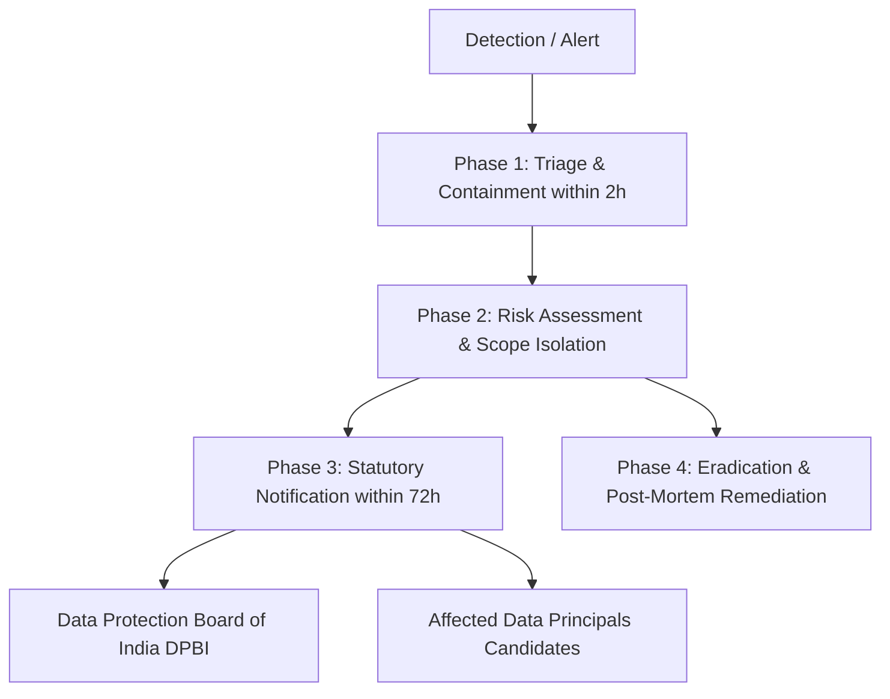

# Digital Personal Data Protection (DPDP) Act 2023 Compliance & Security Incident Response Plan

**Platform:** Proctor AI  
**Role:** Data Fiduciary  
**Candidate Role:** Data Principal  
**Regulatory Framework:** The Digital Personal Data Protection Act, 2023 (Act No. 22 of 2023, Parliament of India)  
**Hosting / Residency:** AWS ap-south-1 (Mumbai, India)  
**Evidence Retention Window:** 90 Days  
**Grievance Officer:** `grievance@proctorai.edu` / `privacy@proctorai.local`  

---

## 1. Compliance Architecture & Statutory Mapping

Under the DPDP Act 2023, Proctor AI processes digital personal data (including biometric facial representations, webcam snapshots, audio anomaly recordings, and behavioral telemetry) solely to verify identity and preserve examination integrity.

| DPDP Act 2023 Section | Statutory Requirement | Proctor AI Implementation Mechanism |
| :--- | :--- | :--- |
| **Section 5** | Notice prior to or at time of consent | Explicit Pre-Exam Consent Modal (`PreExamCheck.tsx`) and dedicated `/privacy` Notice disclosing data categories, purpose, 90-day retention, and residency. |
| **Section 6(1)** | Freely given, specific, informed, and unambiguous consent | Un-prechecked checkboxes for notice acknowledgment and biometric capture. Consent cannot be bundled or assumed by default. |
| **Section 6(4)** | Right to withdraw consent as easily as given | Mid-exam "Withdraw Consent" button in `ExamRoom.tsx`. Automatically ceases all camera, microphone, and browser telemetry immediately. |
| **Section 6(7)** | Evidentiary logging of consent | `dpdp_consent_records` PostgreSQL table storing candidate ID, exam ID, timestamp, client IP, user agent, notice version, and accepted clauses. |
| **Section 8(1)** | Data Fiduciary responsibility & safeguards | Enforced encryption at rest (AES-256) and in transit (TLS 1.3). JWT-based authenticated endpoints with strict Role-Based Access Control (RBAC). |
| **Section 8(6)** | Personal data breach notification | Documented 4-stage Incident Response and Breach Notification Protocol (Section 4 below). |
| **Section 8(7)** | Data minimization & purpose limitation | Periodic snapshots (every 10–15s) rather than 24/7 video streaming. Audio recorded only during sound anomalies. Automatic 90-day retention purge. |
| **Section 9** | Processing of children's personal data | Explicit 18+ age verification checkbox at registration (`Signup.tsx`). Platform strictly scoped to adult college and professional certification exams. |
| **Section 11** | Right to access personal data | Self-service "Download My Data (.JSON)" action in `Settings.tsx` generating a complete export package via `GET /api/v1/privacy/export`. |
| **Section 12** | Right to correction and erasure | Direct profile update for identity data; dedicated "Request Data Erasure" queue and endpoint (`POST /api/v1/privacy/erasure-request`) to purge biometrics. |
| **Section 13** | Grievance redressal mechanism | Designated Data Protection & Grievance Officer with 24-hour acknowledgement SLA and 7-business-day resolution window. |
| **Section 16** | Cross-border transfer restrictions | All databases and processing nodes hosted in AWS ap-south-1 (Mumbai, India). No data transferred to restricted foreign territories. |

---

## 2. Data Minimization & Privacy Audit

A comprehensive review of data collection mechanisms was conducted to ensure no unnecessary technical or personal information is gathered or exposed:

1. **Snapshots vs. Full Video Stream:**
   - Proctor AI captures discrete, low-resolution JPEG snapshots (320x240 / 640x480) every 10–15 seconds during active test windows.
   - Raw 24/7 video feeds are **never stored** on the server filesystem or database, reducing storage footprint and candidate exposure.
2. **Audio Monitoring:**
   - Audio is sampled in ephemeral local buffers using Voice Activity Detection (VAD).
   - Audio chunks are transmitted and stored **only** when audio anomalies (e.g. secondary voices or murmurs) exceed noise confidence thresholds.
3. **Behavioral Telemetry:**
   - Tracking is limited to window blur, tab switching, and fullscreen exit events within the examination window.
   - No browser history, peripheral tabs, or external filesystem directories are inspected.
4. **Credential & Infrastructure Masking:**
   - User-facing diagnostic panels do not expose internal service IPs, backend port numbers, or raw JWT payload tokens.
   - All client responses return sanitised timestamps and UUIDs.

---

## 3. Data Retention & Deletion Schedule

1. **Biometric Face Embeddings & Verification Photos:**
   - Retained for **90 days** from session completion.
   - Purged automatically by background retention jobs or immediately upon candidate erasure requests (`data_erasure_requests`).
2. **Webcam Snapshots & Audio Clips:**
   - Retained for **90 days** to allow for student grade appeals, faculty review, and forensic auditor examination.
   - Erased permanently after 90 days.
3. **Academic Transcripts & Evaluation Scores:**
   - Stored in accordance with institutional academic record retention mandates.
   - Exam responses, test suite outputs, and numerical grades remain archived as institutional educational records.
4. **Consent Audit Logs:**
   - Kept in `dpdp_consent_records` to demonstrate compliance evidence under DPDP Section 6 in the event of regulatory inquiry.

---

## 4. Personal Data Breach Response & Notification Plan (DPDP Section 8(6))

In compliance with Section 8(6) of the DPDP Act 2023 and CERT-In cyber incident directives, Proctor AI maintains an operational breach management workflow:

### Phase 1: Incident Detection & Immediate Containment (0 – 2 Hours)
- **Actions:**
  1. Revoke active JWT session tokens and isolate affected database pools or storage buckets.
  2. Rotate database credentials, API access keys, and storage access tokens.
  3. Freeze application audit logs and create forensically sound filesystem snapshots.

### Phase 2: Impact Assessment & Forensic Scoping (2 – 24 Hours)
- Determine:
  - Exact categories of data impacted (e.g. account emails, baseline photos, violation logs).
  - Number of unique Data Principals (candidates) affected.
  - Probability of identity impersonation or unauthorized biometric extraction.

### Phase 3: Statutory Notification (Within 72 Hours)
- **Notification to Data Protection Board of India (DPBI):**
  - Formal report submitted detailing nature of breach, estimated victims, technical vectors exploited, and remedial containment actions taken.
- **Notification to Affected Candidates (Data Principals):**
  - Plain-language electronic communication via registered email specifying:
    1. Nature and approximate timing of the incident.
    2. Specific data elements exposed (e.g. reference snapshot).
    3. Remedial measures implemented by Proctor AI.
    4. Contact details of the Grievance Officer for questions and mitigation support.

### Phase 4: Eradication & Preventative Remediation (1 – 7 Days)
- Patch identified vulnerabilities, update firewall rules, re-verify database encryption keys, and publish an internal incident review report.

---

## 5. Candidate Grievance Redressal (DPDP Section 13)

- **Contact Point:** Data Protection & Grievance Officer
- **Email:** `grievance@proctorai.edu` / `privacy@proctorai.local`
- **Acknowledgement:** Within 24 hours of ticket receipt.
- **Resolution:** Formal written response and corrective action within 7 business days.
