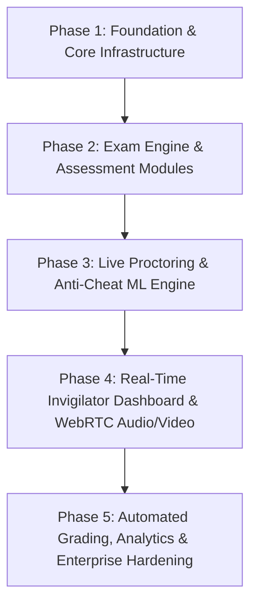
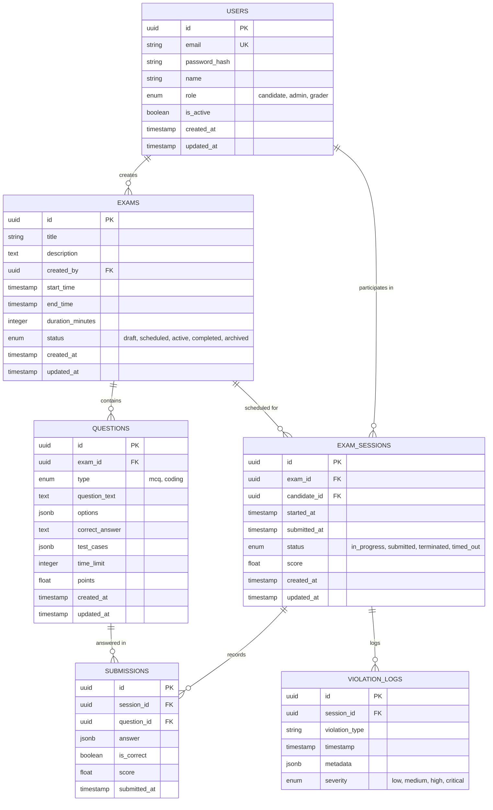
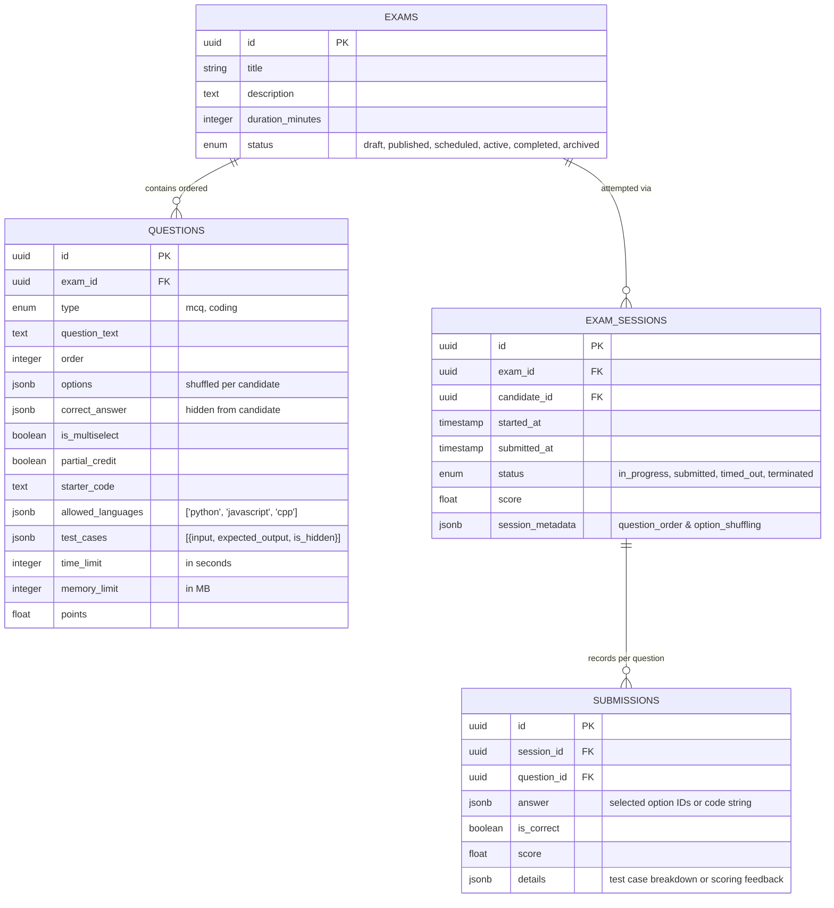

# Online Exam Proctoring & Assessment Platform - Implementation Guide

This document outlines the architectural roadmap across all phases of the platform, with comprehensive technical specifications for **Phase 1: Foundation & Architecture Setup**.

---

## 🗺️ Project Roadmap & Phases Overview



### **Phase 1: Foundation & Core Infrastructure** *(Current Phase)*
- Monorepo folder organization (`/backend`, `/frontend`, `/ml-service`, `/docker`, `/docs`).
- Authentication system with JWT (access + refresh token pattern) and bcrypt password hashing.
- Role-Based Access Control (RBAC) with 3 roles: `candidate`, `admin` (invigilator), `grader`.
- Relational schema in PostgreSQL using SQLAlchemy 2.0 with UUID primary keys and Alembic migrations:
  - `users`, `exams`, `questions`, `exam_sessions`, `submissions`, `violation_logs`.
- Docker Compose orchestration with PostgreSQL, Redis, Judge0, FastAPI backend, ML skeleton, and React Vite frontend.
- Zero-leak `.env.example` configuration and comprehensive developer setup guide.

### **Phase 2: Exam Creation & Assessment Engine** *(Next Phase)*
- Exam lifecycle management: draft, schedule, publish, active, complete, archive.
- Assessment types:
  - Multiple Choice Questions (MCQ) with automated instant scoring.
  - Coding questions with multi-language support (Python, C++, Java, JS) powered by Judge0 code execution engine.
- Candidate exam interface: full-screen lock, countdown timer, autosave, offline persistence, and submission pipeline.
- Invigilator question bank management with test case builder and custom constraints.

### **Phase 3: Automated AI Proctoring & Edge/Service Inference**
- Browser lock & integrity checks (fullscreen enforcement, tab-switch detection, copy-paste blocking, DevTools prevention).
- ML-Service integration:
  - Face detection & face mesh: absence, multiple faces, looking away (head pose / gaze estimation).
  - Voice Activity Detection (VAD) & speech recognition for background whispers/voices.
  - Object/phone detection using lightweight YOLO/MobileNet.
- Real-time violation logging: event stream pushed to Redis and persisted in `violation_logs`.

### **Phase 4: Real-Time Invigilator Dashboard & WebRTC Audio/Video**
- Live WebRTC streaming of candidate webcam, microphone, and desktop screen to invigilators.
- Central invigilator monitoring room with multi-candidate video mosaic.
- Real-time anomaly alerts with severity rating (`low`, `medium`, `high`, `critical`).
- In-exam warning messaging and remote session termination controls.

### **Phase 5: Grading, Analytics, Audit Trail & Enterprise Hardening**
- Manual and automated grading workflows for subjective and coding questions.
- Post-exam integrity audit report with timestamped video snapshots of all flagged violations.
- Prometheus metrics, Grafana dashboards, rate limiting, and GDPR-compliant media retention policies.

---

## 🏛️ Phase 1 Architecture & Specifications

### 1. Monorepo Organization
```
online-exam-proctoring/
├── .env.example              # Template environment variables
├── .gitignore                # Git exclusions across Python, Node, Docker
├── README.md                 # Project introduction and local setup guide
├── docker-compose.yml        # Docker Compose orchestration
├── docs/
│   └── implementation.md     # Multi-phase roadmap and specifications
├── docker/
│   ├── judge0.conf           # Judge0 Community Edition configuration
│   └── README.md             # Container and port mapping details
├── backend/                  # FastAPI Application
│   ├── Dockerfile
│   ├── requirements.txt
│   ├── alembic.ini
│   ├── alembic/
│   │   ├── env.py
│   │   └── versions/
│   │       └── 0001_initial_schema.py
│   ├── app/
│   │   ├── main.py           # FastAPI entrypoint
│   │   ├── core/             # Configuration, database, security, dependencies
│   │   ├── models/           # SQLAlchemy 2.0 ORM models
│   │   ├── schemas/          # Pydantic v2 validation models
│   │   └── api/v1/           # API version 1 endpoints (auth, health, system)
│   └── tests/                # Automated pytest suite
├── ml-service/               # Lightweight ML Proctoring Skeleton
│   ├── Dockerfile
│   ├── requirements.txt
│   └── app/
│       └── main.py           # Health check and inference placeholder
└── frontend/                 # React + TypeScript + Vite
    ├── Dockerfile
    ├── package.json
    ├── tsconfig.json
    ├── vite.config.ts
    ├── index.html
    └── src/                  # React application with sleek dark theme
```

### 2. Database Schema Design (PostgreSQL)

All primary keys use **UUIDv4** to ensure unique, non-sequential, and secure identification across distributed clients.



### 3. Authentication & RBAC Flow

1. **Password Hashing**: Bcrypt with cost factor 12.
2. **Access Token**: Short-lived JWT (15-minute default) carrying `sub` (user UUID), `email`, `role`, and `type="access"`.
3. **Refresh Token**: Long-lived JWT (7-day default) carrying `sub` and `type="refresh"`.
4. **Token Rotation**: When hitting `/api/v1/auth/refresh`, the refresh token is verified and a fresh access token (and new refresh token) is issued.
5. **RBAC Dependency**: `require_roles(UserRole.ADMIN, UserRole.GRADER)` acts as a clean FastAPI dependency to enforce route-level authorization.

### 4. Containerization & Service Ports

| Service | Port | Description |
|---|---|---|
| `frontend` | `5173` | React + TypeScript Vite development server |
| `backend` | `8000` | FastAPI application server with Swagger at `/docs` |
| `ml-service` | `8001` | ML proctoring inference skeleton |
| `judge0-server` | `2358` | Self-hosted Judge0 Code Execution API |
| `postgres` | `5432` | Application PostgreSQL 16 database |
| `redis` | `6379` | Cache, session, and event bus |
| `judge0-db` | `5433` (internal 5432) | Isolated Judge0 database |

---

## ⚡ Phase 2 Architecture & Specifications: Core Exam Engine

### 1. Scope & Objective
Phase 2 delivers the full, end-to-end exam lifecycle:
- **Admin**: Create/edit/delete exams, build MCQ (single/multi-select) and coding questions (with starter code & hidden test cases), reorder questions, enforce publish constraints, and monitor candidate session results.
- **Candidate**: Browse published exams, start timed sessions with anti-cheat data sanitization and randomized question/option ordering, autosave answers, execute visible test cases in Monaco Editor, and submit for server-verified scoring.
- **Strict Constraint**: Zero proctoring features (no webcam, audio, or tab-tracking) in Phase 2.

---

### 2. Database Schema Enhancements (Alembic Migration `0002`)



---

### 3. Anti-Cheat Security & Data Sanitization

1. **Information Leak Prevention**:
   - When a candidate starts or queries an exam session (`/api/v1/candidate/exams/{id}/start`), all questions are sanitized on the backend:
     - `correct_answer` is stripped entirely from the response.
     - For coding questions, all test cases flagged `is_hidden: true` are filtered out. Candidates can only inspect visible example test cases.
2. **Order Shuffling & Determinism**:
   - Questions and MCQ options are randomized for each candidate session using `random.shuffle()`.
   - The generated question IDs and option permutations are persisted in `exam_sessions.session_metadata`. This ensures that candidates cannot copy options (e.g., "Option A") from peers, while grading and post-exam audit reviews remain 100% deterministic.
3. **Server-Side Timer Enforcement**:
   - The expiration time is calculated on the server:
     $$\text{ExpiresAt} = \text{Session.started\_at} + \text{DurationMinutes} + 30\text{s grace period}$$
   - Any `/answer` or `/submit` call arriving after `ExpiresAt` is immediately rejected with `403 Forbidden` (`Exam duration has expired`).
   - If expired upon calling `/submit`, the session status is automatically transitioned to `timed_out`.
4. **Zero Client Trust**:
   - Scores and pass/fail states sent by the client are ignored. All grading occurs purely server-side.

---

### 4. Server-Side Scoring Engine

#### Multiple Choice Questions (MCQ)
- **Single-Select**:
  - Full points if chosen option ID matches `correct_answer`.
  - 0 points otherwise.
- **Multi-Select with Partial Credit**:
  - Let $C_{total}$ be total correct options, $C_{user}$ be correct options selected, and $W_{user}$ be incorrect options selected:
    $$\text{Score} = \max\left(0, \frac{C_{user} - W_{user}}{C_{total}}\right) \times \text{Points}$$
  - If `partial_credit` is `False`, all correct options and zero incorrect options must be selected to receive full points.

#### Coding Questions
- Code is evaluated against **all test cases** (both visible and hidden).
- Let $N_{total}$ be total test cases and $N_{passed}$ be passed test cases:
  $$\text{Score} = \left(\frac{N_{passed}}{N_{total}}\right) \times \text{Points}$$
- Individual test case results (status, stdout, execution time) are recorded in `submissions.details`.

---

### 5. Judge0 Code Execution Integration

- **Container Endpoints**: Connects to `http://judge0-server:2358` (or `http://localhost:2358`).
- **Supported Languages**:
  - Python 3 (`id: 71`)
  - JavaScript / Node.js (`id: 63`)
  - C++ / GCC (`id: 54`)
- **Execution Safeguards**:
  - Rate limiting enforced via backend: maximum 1 execution per 5 seconds per candidate.
  - Standard time limit (5 seconds) and memory limit (128 MB) configured per question.
  - Test Fallback Engine: If Judge0 container is unavailable during integration tests or local development, a fallback runner seamlessly processes the test suite without breaking server continuity.

---

### 6. API Reference (Phase 2 Endpoints)

#### Admin Exam Management (`/api/v1/admin/exams`)
- `POST /` - Create an exam (title, description, duration, start/end dates).
- `GET /` - List all exams created by admin or system.
- `GET /{id}` - Get full exam details including questions, correct answers, and hidden test cases.
- `PUT /{id}` - Update exam metadata.
- `DELETE /{id}` - Soft-delete / delete exam.
- `PATCH /{id}/status` - Update exam status (`draft`, `published`, `archived`). **Enforces $\ge 1$ question constraint before publishing.**
- `POST /{id}/questions` - Add MCQ or Coding question.
- `PUT /{id}/questions/{qid}` - Update question content, options, starter code, or test cases.
- `DELETE /{id}/questions/{qid}` - Delete question.
- `PATCH /{id}/questions/reorder` - Reorder questions sequentially.
- `GET /{id}/sessions` - View all candidate submissions, total scores, completion times, and status.

#### Candidate Exam Engine (`/api/v1/candidate/exams`)
- `GET /` - List all published exams available to take.
- `POST /{id}/start` - Begin exam session. Sanitizes answers, randomizes questions/options, and records `started_at`.
- `POST /{id}/answer` - Autosave/update answer for a single question. Enforces server timer.
- `POST /{id}/run-code` - Run user code against visible test cases via Judge0. Enforces 5-second rate limit.
- `POST /{id}/submit` - Final exam submission. Scores all questions server-side, saves submissions, and sets session status to `submitted`.
- `GET /{id}/result` - Retrieve post-exam candidate score breakdown.

---

### 7. Frontend User Experience (React + TypeScript)

- **Candidate Exam Room** (`/candidate/exam/:id`):
  - Sticky top header with live synced countdown timer (amber warning at $<5$ min, red pulsing at $<1$ min).
  - Question navigation sidebar showing answered, current, and unvisited states.
  - MCQ view supporting radio (single-select) and checkbox (multi-select) modes with real-time autosave indicators.
  - Coding view with embedded **Monaco Editor**, language switcher (Python, JavaScript, C++), "Run Visible Tests" terminal console, and submission confirmation modals.
- **Score Breakdown View** (`/candidate/exam/:id/result`):
  - Overall percentage, earned points vs total points, and question-by-question breakdown.
- **Admin Exam Builder** (`/admin/exams/builder/:id`):
  - Tabbed interface to edit exam settings and build questions.
  - Interactive MCQ builder (add/remove options, mark correct answers, toggle multi-select and partial credit).
  - Coding problem builder (configure starter code, memory/time limits, add visible & hidden test cases).
  - Drag-and-drop or up/down question reordering.
  - Candidate session results viewer (`/admin/exams/:id/sessions`) with score tables and status filters.

---

## 🎨 Phase 2.5 Architecture & Specifications: Design System & Re-Skin

### 1. Scope & Objective
Phase 2.5 applies a cohesive, flat, calm monochrome design system across the entire frontend application without altering backend endpoints, scoring algorithms, Judge0 execution, or authentication logic.

### 2. Design Tokens & Theme Configuration
- **Palette**:
  - Surfaces: `surface` (`#fdf8f8`), `surface-container-low` (`#f7f3f2`), `surface-container` (`#f1edec`), `surface-container-high` (`#ebe7e6`), `surface-container-highest` (`#e5e2e1`), `surface-container-lowest` (`#ffffff`).
  - Text & Accents: `primary` (`#000000`), `on-primary` (`#ffffff`), `secondary` (`#5e5e5e`), `on-surface` (`#1c1b1b`), `on-surface-variant` (`#444748`), `outline` (`#747878`), `outline-variant` (`#c4c7c7`).
  - Muted Semantics:
    - `success` (`#2d6335`) & `success-container` (`#dbeef0`) for passed tests and healthy statuses.
    - `warning` (`#7a5912`) & `warning-container` (`#fcedd7`) for timer alerts and in-progress states.
    - `error` (`#ba1a1a`) & `error-container` (`#ffdad6`) for failures and test regressions.
- **Typography & Icons**:
  - Text font: **Inter** loaded via Google Fonts.
  - Monospace font: **JetBrains Mono** for code and test case inspection.
  - Iconography: **Material Symbols Outlined** loaded via Google Fonts.
- **Radius Scale**:
  - Pill shape: `rounded-full` (`9999px`) for all action buttons, input fields, badges, and tab switchers.
  - Cards: `rounded-2xl` (`1rem`) and `rounded-3xl` (`1.5rem`) with 1px border (`border-outline-variant`), flat and calm with no heavy drop shadows.
  - Hero Panels: Soft radial fog-gradient backgrounds (`fog-gradient-card`, `fog-gradient-hero`) applied strictly to celebratory/summary moments (Exam Results screen and Dashboard header).
- **Code Panels**:
  - Dark frame (`#111111`) with rounded-2xl geometry, monospace font, syntax highlighting via Monaco Editor (`vs-dark`).

### 3. Shared Component Library (`frontend/src/components/ui/`)
- `Button`: Pill-shaped buttons with `primary` (solid black), `secondary` (transparent with outline), `destructive`, and `ghost` variants with icon slotting and loading spinner support.
- `Card`: Flat container with `default`, `fog`, `surface`, and `dark` variants supporting rounded-2xl/3xl borders.
- `Badge`: Small pill-shaped status indicator enforcing **dual cue** rules (always pairing color with an icon and label). Includes a `critical` variant (`border-2 border-error text-on-error-container bg-error-container font-semibold animate-pulse`) to prevent severe proctoring violations from blending into the monochrome palette.
- `PillTab`: Accessible segmented tab switcher for mode toggling (e.g. MCQ vs Coding assessment).
- `Icon`: Material Symbols Outlined wrapper.

---

## 👁️ Phase 3 Architecture & Specifications: Browser-Level Proctoring

### 1. Scope & Objective
Phase 3 establishes browser-level anti-cheat controls and proctoring signal detection without camera/mic ML inference (which arrives in Phase 4). It introduces hardware permission verification, fullscreen enforcement, tab-away tracking, paste-burst anomaly logging, input deterrents, and server-side re-validation with auto-termination capabilities.

### 2. Database & Schema Enhancements (Alembic Migration 0003)
- **`exams` table additions**:
  - `enable_browser_proctoring` (BOOLEAN, default TRUE): Enables or disables proctoring policies per exam.
  - `max_fullscreen_exits` (INTEGER, default 2): Maximum number of fullscreen exits permitted before auto-submission.
  - `fullscreen_warning_timeout_seconds` (INTEGER, default 10): Countdown window given to return to fullscreen.
  - `max_tab_away_seconds` (INTEGER, default 60): Cumulative tab-switch duration tolerance before auto-submission.
  - `paste_char_threshold` (INTEGER, default 50): Character burst length triggering an anomaly log.
- **`exam_sessions` table additions**:
  - `media_permission_granted_at` (TIMESTAMP WITH TIME ZONE, nullable): Records when the candidate passed the camera/mic check.
  - `fullscreen_exit_count` (INTEGER, default 0): Accumulated count of fullscreen exit events.
  - `total_tab_away_seconds` (INTEGER, default 0): Accumulated duration spent away from the examination tab.
  - `terminated_reason` (VARCHAR(500), nullable): Explicit explanation logged when auto-termination triggers.
  - Status extended to support `terminated`.

### 3. Server-Side Proctoring Engine (`backend/app/services/proctoring.py`)
- **Zero-Trust Severity Re-Validation**:
  - `fullscreen_exit`: 1st exit $\rightarrow$ `medium`; $\ge \text{max\_fullscreen\_exits}$ or `is_timeout=True` $\rightarrow$ `critical` (triggers session termination).
  - `tab_switch`: $<5$s $\rightarrow$ `low`; $5-14$s $\rightarrow$ `medium`; $\ge 15$s $\rightarrow$ `high`; cumulative $\ge \text{max\_tab\_away\_seconds}$ $\rightarrow$ `critical` (triggers auto-submit).
  - `paste_burst`: $<50$ chars $\rightarrow$ `low`; $50-149$ chars $\rightarrow$ `low`; $150-299$ chars $\rightarrow$ `medium`; $\ge 300$ chars $\rightarrow$ `high`.
  - `copy_attempt` / `context_menu_attempt` $\rightarrow$ `low`.
  - `devtools_attempt` $\rightarrow$ `medium`.
- **Termination & Auto-Submission Pipeline**:
  - Automatically finalizes sessions with `status="terminated"`.
  - Computes and locks in candidate scores from existing saved answers, ensuring all progress up to the violation is credited.
  - Generates immutable entries in `violation_logs`.

### 4. API Endpoints
- `POST /api/v1/candidate/exams/{id}/verify-media`: Verifies camera and microphone permissions before entry.
- `POST /api/v1/candidate/sessions/{id}/violations`: Processes single or batch violation events from the client, recalculates counters, and returns termination directives.
- `GET /api/v1/candidate/sessions/{id}/violations`: Allows candidate to view their integrity log.
- `GET /api/v1/admin/exams/{id}/sessions/{session_id}/violations`: Admin endpoint for reviewing full chronological violation history.

### 5. Candidate Frontend Experience (`frontend/src/pages/candidate/`)
- **Pre-Exam Verification Screen** (`/exams/:examId/check`):
  - Hardware permission request for video and audio (`getUserMedia`).
  - Live mirrored camera feed `<video autoPlay playsInline muted />`.
  - Real-time Web Audio API frequency visualizer displaying microphone sensitivity.
  - Visual checklist for camera, microphone, and fullscreen readiness.
  - Seamless fullscreen request on entering exam room.
- **Enforced Exam Room** (`/exams/:examId/take`):
  - Sticky header with real-time "Proctoring Active" badge.
  - Fullscreen departure detection with 10-second countdown warning modal and return button.
  - Focus and visibility change tracking with non-intrusive floating toast notifications.
  - Non-blocking Monaco editor paste listener flagging paste bursts $\ge 50$ characters with snippet previews.
  - Input deterrents: disabled right-click context menu, non-selectable question text, and trapped DevTools shortcuts (F12, Ctrl+Shift+I/J/C, Ctrl+U).
- **Admin Proctoring Audit** (`/admin/exams/:id/sessions`):
  - Candidate submission table augmented with real-time proctoring counters (`fullscreen_exit_count`, `total_tab_away_seconds`, `terminated_reason`).
  - Dedicated "Audit Logs" modal rendering chronological timeline with severity badges and event metadata.
- **Admin Exam Builder** (`/admin/exams/:id/builder`):
  - Configurable proctoring toggle and threshold adjustment inputs for all integrity limits.

---

## 🎥 Phase 4 Architecture & Specifications: Video & Audio ML Proctoring

### 1. Scope & Objective
Phase 4 connects the ML service to the platform to provide automated, privacy-conscious computer vision and audio anti-cheat proctoring. Rather than bandwidth-heavy continuous video streaming, Phase 4 employs periodic downscaled frame sampling (320x240 JPEG every 5–10s) and rolling audio slices (3s WAV/PCM every 12s), persisting forensic evidence only for flagged violations with strict authenticated access and a 90-day retention policy.

### 2. ML Proctoring Microservice (`ml-service/`)
- **Face Analysis Engine (`app/services/face_engine.py`)**:
  - **Face Detection & Counting**: Multi-scale Haar cascade classifier (`haarcascade_frontalface_default.xml`). Flags 0 faces (`no_face_detected`) and $\ge 2$ faces (`multiple_faces_detected`).
  - **128-d DCT Facial Feature Embedding**: Normalizes detected face region to 64x64 grayscale, applies 2D Discrete Cosine Transform (DCT), zero-centers the frequency space, and excludes the $[0, 0]$ DC illumination component to extract a robust 128-dimensional biometric descriptor.
  - **Cosine Similarity Identity Verification**: Measures vector similarity against the candidate's reference embedding captured during the pre-exam check. Flags similarity $< \text{face\_similarity\_threshold}$ (default 0.60) as `face_mismatch`.
- **Audio Voice Activity Detection (VAD) Engine (`app/services/audio_engine.py`)**:
  - Analyzes 16-bit PCM / WAV slices using WebRTC VAD across 30ms frames, combined with RMS energy and Zero-Crossing Rate (ZCR) acoustic analysis.
  - Calculates instant speech duration, speech ratio, and energy profile to eliminate ambient background white noise.
- **Microservice Endpoints**:
  - `GET /health`: Health and model readiness check.
  - `POST /api/v1/ml/extract-embedding`: Computes 128-d reference facial embedding from candidate baseline portrait.
  - `POST /api/v1/ml/evaluate-frame`: Evaluates periodic webcam frame for face count, anomaly, and biometric similarity.
  - `POST /api/v1/ml/evaluate-audio`: Evaluates rolling audio slice for human vocal activity.

### 3. Database Schema Enhancements (Alembic Migration `0004_video_audio_proctoring`)
- **`exams` table additions**:
  - `proctor_frame_interval_seconds` (INTEGER, default 10): Frequency of candidate webcam sampling.
  - `face_similarity_threshold` (FLOAT, default 0.60): Minimum cosine similarity to baseline face.
  - `consecutive_no_face_limit` (INTEGER, default 3): Consecutive absence checks before escalating to critical auto-termination.
  - `sustained_audio_threshold_seconds` (FLOAT, default 5.0): Maximum cumulative speech allowed in audio window.
  - `audio_window_seconds` (INTEGER, default 30): Rolling time window for speech accumulation.
- **`exam_sessions` table additions**:
  - `reference_photo_path` (VARCHAR(500), nullable): Evidence storage identifier for baseline portrait.
  - `reference_embedding` (JSONB, nullable): 128-d normalized facial vector.
  - `consecutive_no_face_count` (INTEGER, default 0): Current consecutive absence counter.
  - `audio_speech_seconds_in_window` (FLOAT, default 0.0): Cumulative speech within current window.
  - `last_audio_window_reset` (TIMESTAMP WITH TIME ZONE, nullable): Start timestamp of current rolling window.
- **`violation_logs` table additions**:
  - `evidence_url` (VARCHAR(500), nullable): Protected URL for administrative forensic inspection.

### 4. Backend Proctoring Service & Evidence Retention
- **Graceful ML Service Degradation**:
  - `MLClient` executes requests with a 3.5s timeout.
  - If the ML container is offline or times out, the exam is **never interrupted**. The system records a `proctoring_gap` violation (`severity="low"`) and returns `status="degraded"`, allowing the candidate to continue without disruption.
- **Encrypted Evidence Storage (`backend/app/services/storage.py`)**:
  - Flagged frames (`.jpg`) and audio clips (`.wav`) are saved in `storage/evidence/{session_id}/`.
  - Non-violating periodic frames are immediately discarded to conserve bandwidth and protect candidate privacy.
  - Stored with 90-day FERPA/academic compliance retention metadata (`retention_policy="90_days"`, `expires_at`).
  - **Authenticated Admin Streaming Endpoint**: `GET /api/v1/admin/evidence/{file_id}` permits only authenticated invigilators/admins to stream binary evidence files; candidates receive HTTP 403 Forbidden.

### 5. Candidate & Invigilator Frontend Experience
- **Biometric Reference Enrollment (`PreExamCheck.tsx`)**:
  - Automatically captures high-resolution baseline portrait from the candidate's webcam upon permission grant.
  - Submits portrait to `/verify-media` for baseline embedding registration and provides visual confirmation ("Reference Face Registered").
- **Real-Time Proctoring Picture-in-Picture (`ExamRoom.tsx`)**:
  - Re-acquires webcam and microphone stream on exam launch.
  - Renders floating, collapsible Picture-in-Picture (PiP) widget in the bottom-right corner displaying live camera preview, audio monitoring status, and real-time AI face verification badge.
  - Background frame capture loop transmits 320x240 JPEG snapshots every 10 seconds.
  - Background audio loop captures 3-second slices via `MediaRecorder` every 12 seconds.
  - In-exam warning toasts notify candidate of camera obstruction, multiple individuals, or sustained talking.
  - Auto-submits exam if candidate is absent for $\ge 3$ consecutive checks or if identity mismatch is confirmed.
- **Forensic Evidence Inspection Modal (`AdminExamSessions.tsx`)**:
  - Invigilators reviewing session audits see dedicated "Evidence Stored" tags on flagged events.
  - Clicking "Inspect Photo Snapshot" or "Listen to Audio Clip" securely fetches binary data via authenticated blob streaming.
  - Renders image inspection modal or interactive HTML5 audio playback player with 90-day retention compliance notices.

